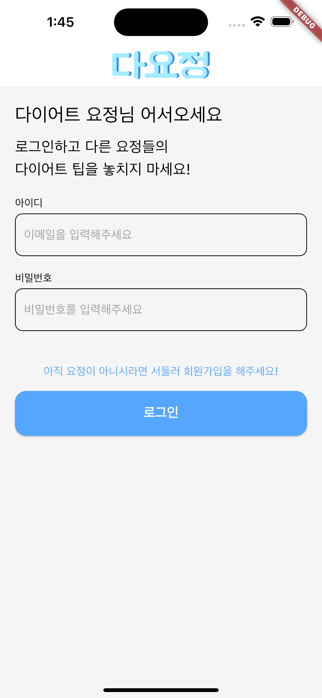
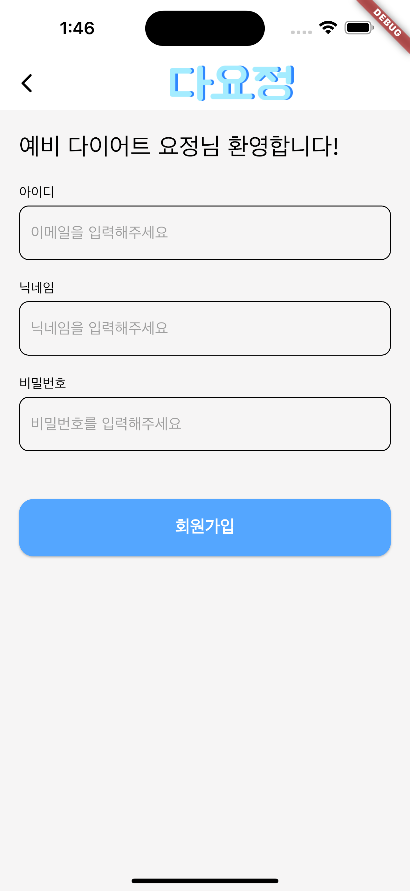
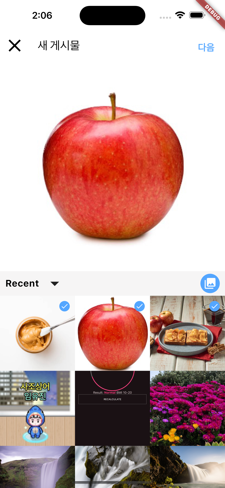
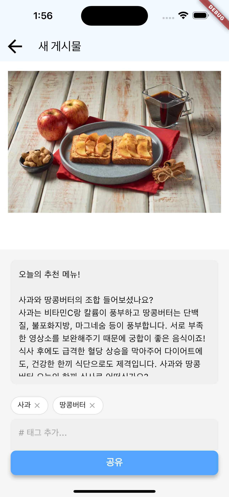
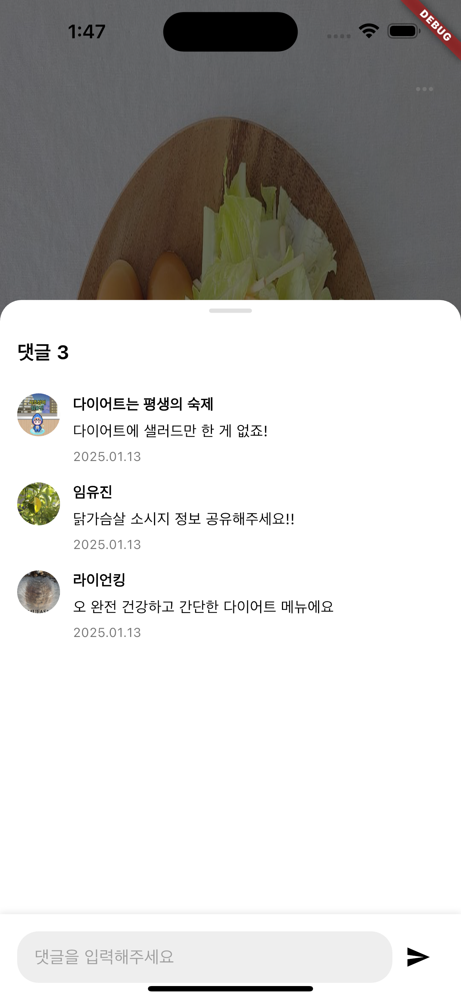
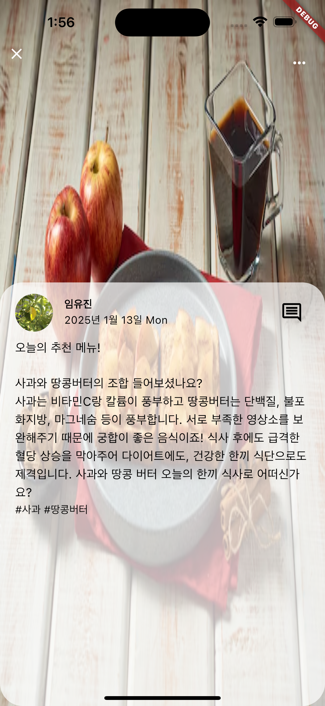
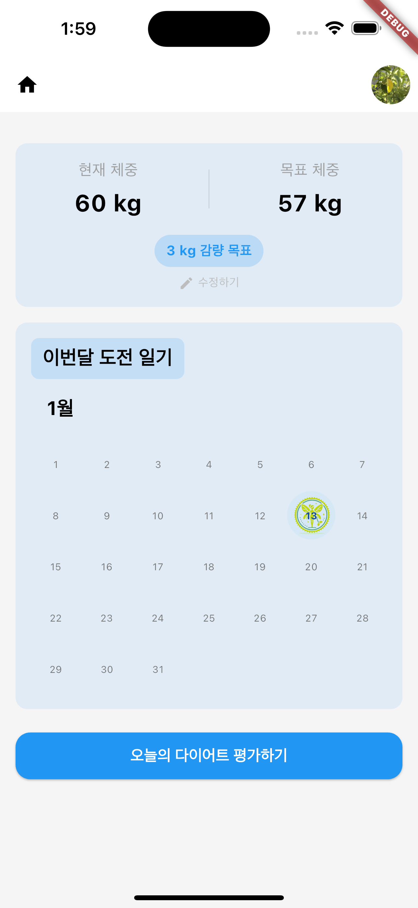
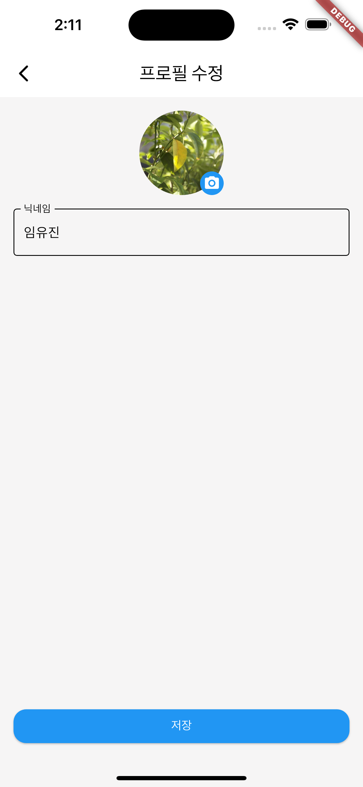

# 🧚 다요정(다이어트 요정들의 정보일지)
<br/>
<p align='center'>
    
</p>
<br/>
Flutter 로 만든 SNS 앱입니다. 다이어터들의 팁을 볼 수 있고 유용한 정보를 얻을 수 있어요!

<br/><br/>
## 🖥 시연 영상
### https://www.youtube.com/shorts/3RhqYLFntSs
<br/><br/>
## 📌 주요 기능
### 1. 회원가입 및 로그인
<p align='center'>
    
    
</p>

- 이메일, 닉네임, 비밀번호를 통해 회원가입을 할 수 있습니다.
- 회원가입 후 로그인을 하면 피드를 볼 수 있습니다.
<br/><br/>
### 2. 사진 및 글 작성 기능
<p align='center'>
    
    
</p>

- 사진, 본문 내용, 태그를 필수로 입력해야 게시물을 올릴 수 있습니다.
- 사진은 음식 사진만 등록이 가능합니다.
- 여러 장의 음식 사진 등록이 가능합니다.
<br/><br/>
### 3. 메인 피드 + 댓글
<p align='center'>
    
    
    
</p>

- 다른 사람이 올린 사진과 팁들을 확인할 수 있습니다.
- 게시물에는 댓글을 달 수 있습니다.
<br/><br/>
### 4. 나의 정보 페이지
<p align='center'>
    
    
    
</p>
- 닉네임을 변경할 수 있고, 프로필 사진을 등록할 수 있습니다. 
- 현재 체중과 목표 체중을 입력하여 눈에 보이는 증감량 무게를 알 수 있습니다.
- 오늘의 나의 상태를 입력하면 달력에 요정 스티커를 받을 수 있습니다.
<br/><br/>

## 🛠 기술 스택
- Framework: Flutter
- Language: Dart
- State Management: Riverpod
- Server: Firebase
- Authentication: Firebase Authentication
- Validation: 
    - 사용자 입력값 검증 및 예외 처리 
    - Yolo 모델을 활용해 음식 사진만 감지
<br/><br/>

## 👀 설치 및 실행
### 1. Flutter 설치
Flutter가 설치되어 있어야 해당 프로젝트를 실행할 수 있습니다. [Flutter 설치 가이드](https://docs.flutter.dev/get-started/install)를 참고하세요.

- 프로젝트 clone
```
git clone https://github.com/diet-fairy/diet-fairy.git
```
- 의존성 설치
```
flutter pub get
```
